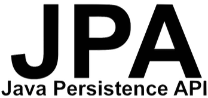

<p align=center>
    <span style="color: gray">취업 준비생들을 위한 포트폴리오 및 경험 정리 블로그</span>
</p>

----


<p align=left>
    <p>📃 프로젝트 및 경험을 보기 쉽게 정리하세요.</p>
    <p>🔖 각 요소마다 태그를 달아 활용성을 높여보세요.</p>
    <p>⭐ 한 눈에 필요한 자료를 확인해보세요.</p>
</p>


## Teck Stack

<div>
    
    
    
    
</div>


## Install

```cmd
npm install
yarn install
```


## Usage

```cmd
npm run serve --port 3000
```


## Contributors

Team: LP

* [박석우](https://lab.ssafy.com/pseokwooo)는 FrontEnd 구현을 도왔습니다.
* [이솔](https://lab.ssafy.com/tedy55)은 FrontEnd 구현을 도왔습니다.
* [박재성](https://lab.ssafy.com/wotjd4305)은 BackEnd 구현을 도왔습니다.
* [이수연](https://lab.ssafy.com/qkdqnwpwp)은 BackEnd 구현을 도왔습니다.
* [한지혜](https://lab.ssafy.com/hangji0124)는 BackEnd 구현을 도왔습니다.

